# 📱 Expense Tracker iOS App

A clean, fast, and minimal personal finance app built with React Native (Expo) focused on budgeting, analytics, and simplicity.

---

## ✨ Features

### 💰 Transactions
- Add, edit, delete transactions  
- Swipe actions (edit / delete)  
- Filter by type and category  
- Sort by date or amount  

---

### 📊 Stats & Analytics
- Expense trend charts  
- Monthly summaries  
- Category breakdown  
- Top spending categories  
- Largest expenses tracking  

---

### 🎯 Limits (Budgeting)
- Set monthly category limits  
- Track spending progress  
- Visual progress bars  
- Monthly reset system  

---

### ⚡ UX & Design
- Smooth animations  
- Collapsing header  
- Dark theme UI  
- Bottom sheets & modals  
- Fast and responsive  

---

## 📸 Screenshots

### 🏠 Home

  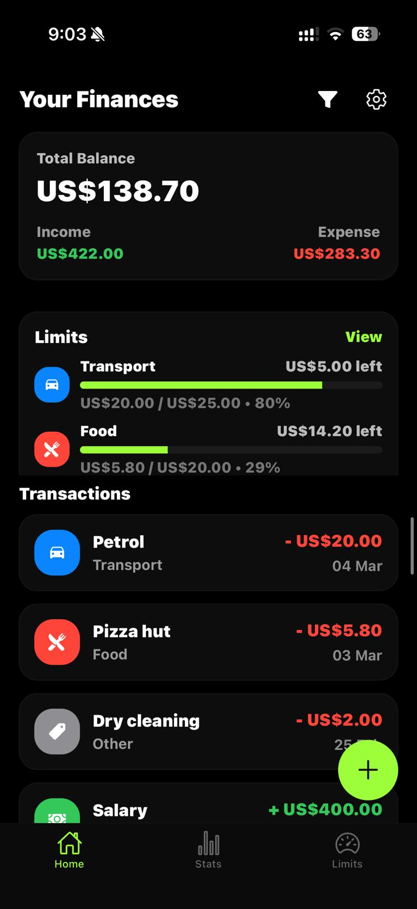
  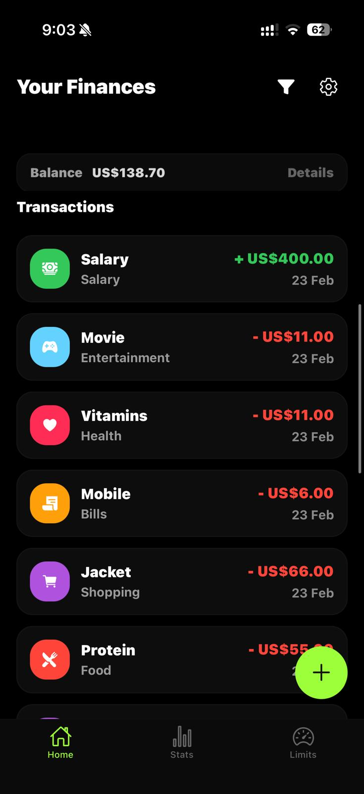
  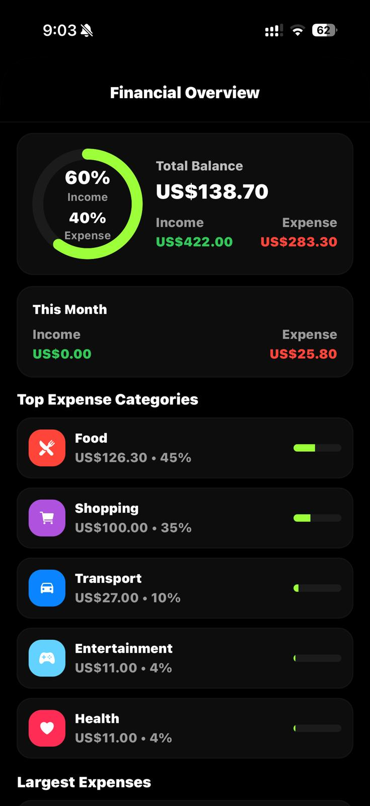

---

### 🔄 Transactions & Actions

  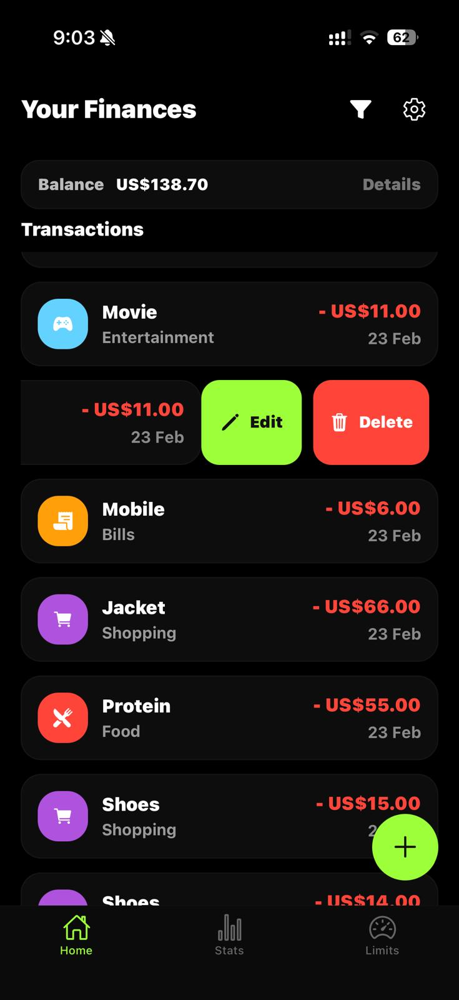
  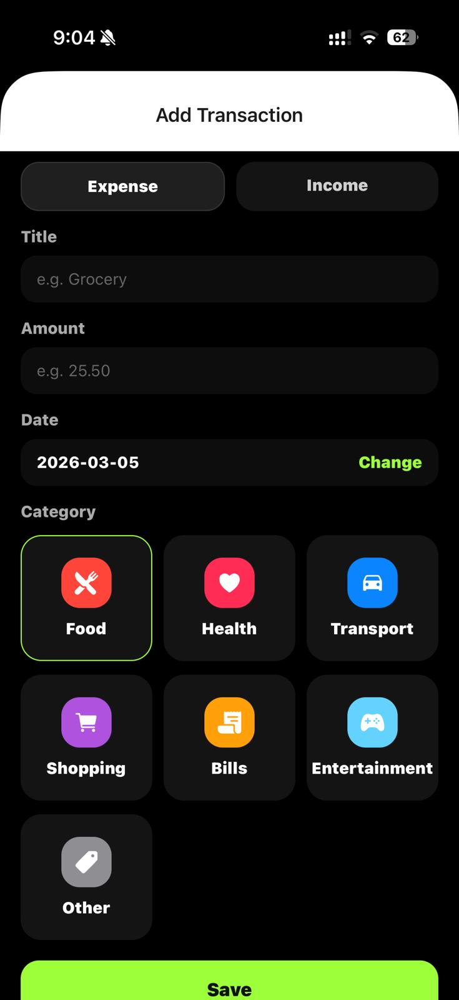
  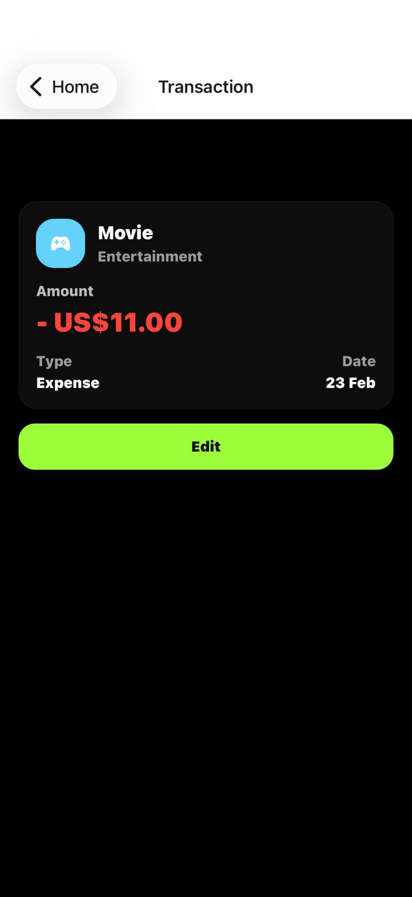

---

### 📊 Stats & Analytics

  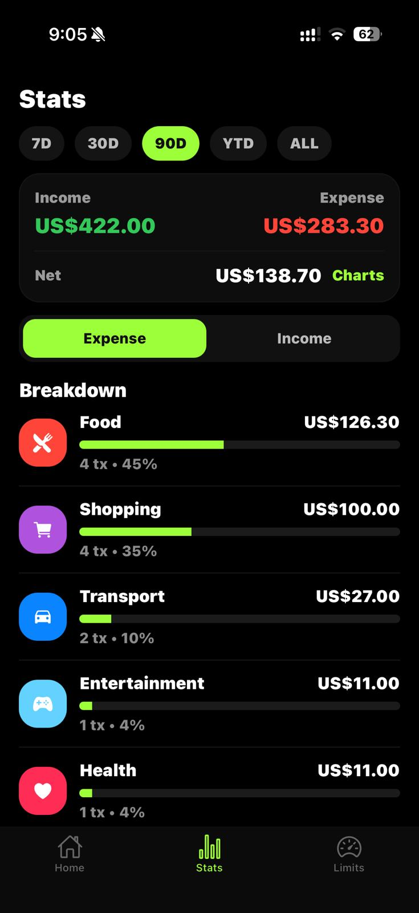
  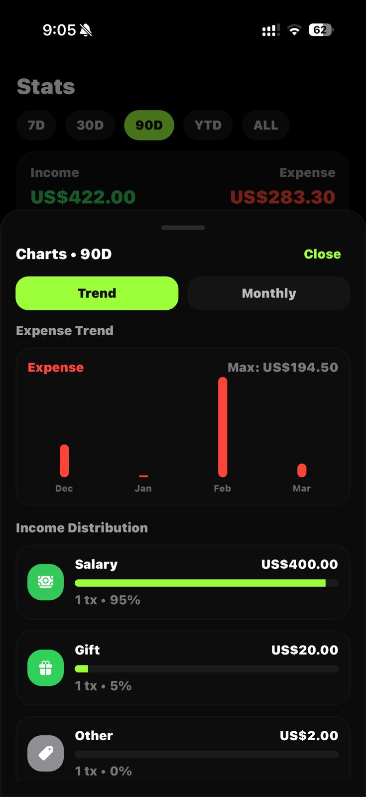
  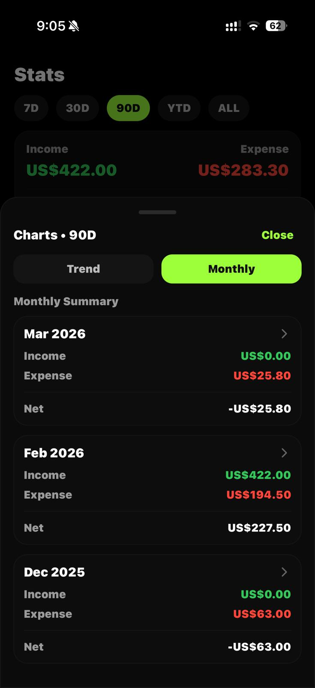

---

### 🎯 Limits & Budgeting

  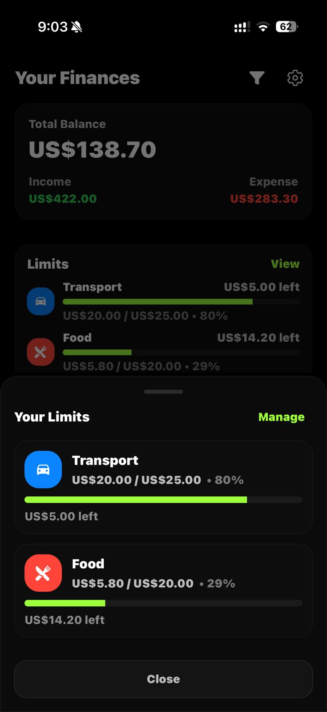
  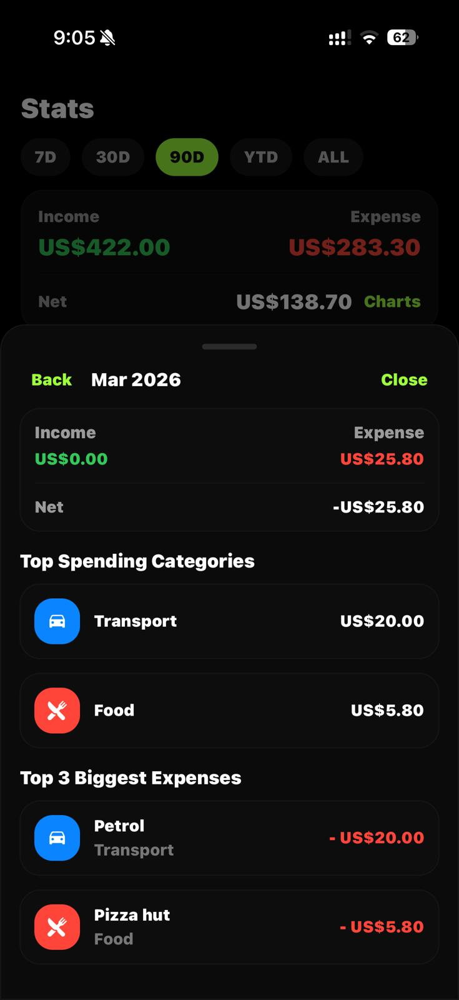
  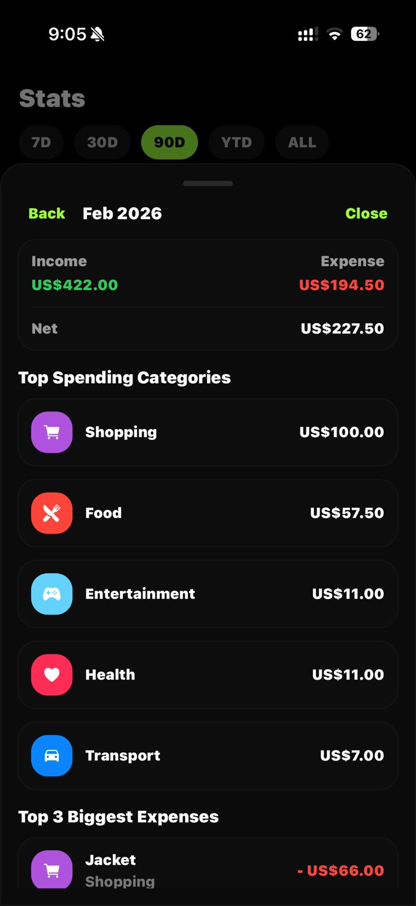
  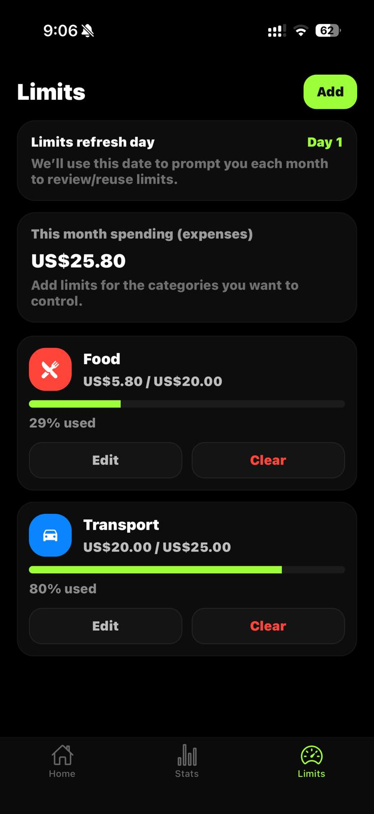

---

### ⚙️ Settings

  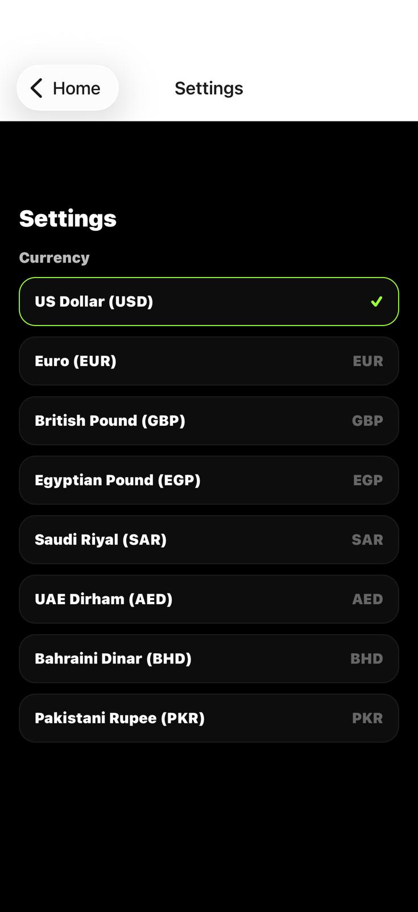
 

---

### 🔍 Filters

 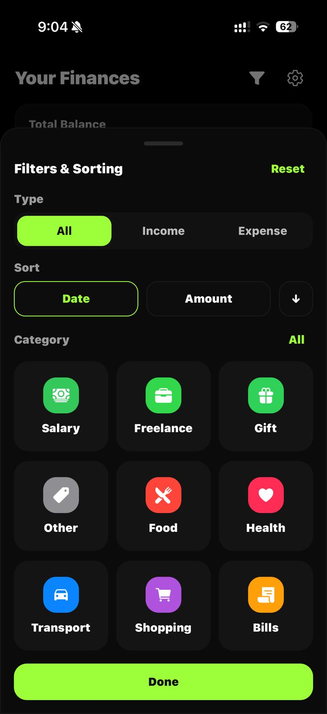

---

## 🛠 Tech Stack

- React Native (Expo)
- expo-router
- Zustand
- AsyncStorage
- React Native Reanimated
- Ionicons
- TypeScript

---

🚀 Getting Started
1. Install dependencies
   npm install
2. Run the app
   npx expo start
3. Run on device (iphone/android)
   Install Expo Go and scan the QR code.
